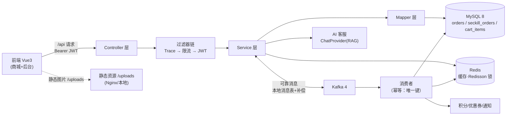

# LinkForge 后端

> 一个基于 **Spring Boot 4.0.5 + Java 21** 的电商后端参考项目，覆盖用户、商品、订单、秒杀、购物车、优惠券、积分、AI 客服、文件上传等完整业务域，整合 **Kafka 可靠消息最终一致性**、**Redis Lua 原子秒杀**、**Redisson 分布式锁**、**Spring Security + JWT** 与 **消费幂等** 等企业级核心机制。

    

📖 详细文档：[架构设计](docs/ARCHITECTURE.md) · [API 示例](docs/API_EXAMPLES.md) · [Docker 部署](deploy/docker/README.md)

## 功能总览

| 模块 | 能力 | 亮点机制 |
|------|------|----------|
| 用户/认证 | 注册、登录、JWT、角色（USER/ADMIN） | **注册强制 USER（防提权：仅 ADMIN 可建 ADMIN）**；BCrypt；24h Token |
| 商品 | CRUD、图片上传、上下架、分页 | 本地 `uploads/` + 静态映射；类型白名单（jpg/png/webp ≤5MB） |
| 订单 | 下单（多商品+优惠券）、支付、取消、发货、确认收货 | Redisson 防重复下单；**服务端计价**；条件更新防并发 |
| 可靠消息 | 支付/取消事件 → Kafka 异步处理 | **本地消息表 + 定时补偿 + 消费幂等（唯一键）**，最终一致 |
| 秒杀 | 活动管理、抢购、支付/取消/退款、超时关单 | **Redis Lua 原子扣减 + 限购 + 布隆过滤**；Kafka 削峰建单；DB 条件扣减双保险 |
| 购物车 | 加购/改量/删除/列表/角标 | 落库（cart_items，UNIQUE(user,product)） |
| 优惠券 | 领取、我的券、下单抵扣 | 限一人一张；FROZEN→USED 状态机 |
| 积分 | 支付发放、取消/退款回退 | 流水唯一键幂等（uk_order_type） |
| AI 客服 | 对话（订单/积分/发货查询） | **ChatProvider 抽象**：DeepSeek（OpenAI 兼容）+ RAG（实时注入用户订单上下文） |
| 通知 | 支付/发货/取消通知 | **Provider 抽象**：Email/Sms 占位 + 配置开关，接运营商零改动 |
| 安全 | JWT 鉴权、URL 权限、IP 限流 | 登录 5次/分、注册 10次/时、全局 100 QPS |

## 系统架构



## 核心机制

### 1. 订单可靠消息（最终一致性）
```
业务操作 ──► 单事务（订单状态 + 本地消息表 PENDING）
                │
                ▼
          定时补偿扫描 ──► Kafka ──► 标记 SENT
                │                     │
           失败重试（幂等）        消费者处理（库存/积分/券/通知，唯一键幂等）
```
- 消息与业务**同事务**落库，补偿任务兜底发送，不存在"业务成功消息丢失"
- 消费者 `order_process_record` 唯一键 + 条件更新，重复消息直接跳过

### 2. 秒杀链路（Lua 原子 + Kafka 削峰）
```
抢购 ──► 时间窗校验 ──► 布隆过滤(防刷) ──► Lua 原子（库存预扣 + 用户去重）
              │
              ▼
       雪花单号 + Kafka 直发（热路径不碰 DB）
              │
              ▼
     消费者落库 PENDING ──► 支付(发积分) / 取消 / 退款 / 超时关单
```
- Redis 库存与 DB `available_stock` 双保险（条件更新防超卖）
- 取消/退款：回加库存 + 释放限购名额（SREM）+ 积分回退

### 3. 安全红线
- 注册强制 USER，仅 ADMIN 可建 ADMIN（Service 层单一校验点）
- 订单/购物车/秒杀单**归属校验**（userId 取自 SecurityContext，不信任前端）
- **服务端计价**：金额以数据库快照为准，请求只传商品+数量
- 秒杀单查询/支付/取消/退款全链路归属校验（已修复越权漏洞）

## 快速开始

### 本地开发（dev profile）
前置：JDK 21、MySQL 8、Redis、Kafka

```bash
mysql -u root -p < src/main/resources/db/schema.sql   # 建库建表+种子
./gradlew bootRun                                      # 启动 http://localhost:8080
```

### Docker 一键部署（推荐）
```bash
docker compose up -d --build
# 前端 http://localhost:3000（admin/Test@1234）| 后端 http://localhost:8080
```
详见 [deploy/docker/README.md](deploy/docker/README.md)。

### 生产环境（prod profile）
敏感配置全环境变量化（`application-prod.yml`）：
`DB_URL / DB_USERNAME / DB_PASSWORD / REDIS_HOST / KAFKA_BOOTSTRAP_SERVERS / JWT_SECRET / FILE_UPLOAD_DIR / SUPPORT_AI_API_KEY`

## 主要 API（完整示例见 docs/API_EXAMPLES.md）

| 模块 | 接口 |
|------|------|
| 认证 | `POST /api/auth/login` |
| 用户 | `POST /api/users`(注册)、`GET/PUT/DELETE /api/users/{id}`、`PATCH /{id}/status`、`GET /api/users` |
| 商品 | `GET /api/products`、`POST/PUT/DELETE /api/products/**`(ADMIN) |
| 文件 | `POST /api/files/upload`(ADMIN) |
| 订单 | `POST /api/orders`、`GET /{id}`、`POST /{id}/pay`、`/cancel`、`/ship`(ADMIN)、`/confirm` |
| 秒杀 | `POST /api/seckill/{activityId}`、`/orders/{orderNo}/pay`、`/cancel`、`/refund`、`/api/seckill/admin/**`(ADMIN) |
| 购物车 | `GET/POST /api/cart`、`PUT/DELETE /api/cart/{id}`、`GET /api/cart/count` |
| 优惠券 | `GET /api/coupons`、`POST /api/coupons/{id}/claim`、`GET /api/coupons/mine` |
| 客服 | `POST /api/support/chat`（AI+RAG） |

> 注：积分通过订单支付/秒杀链路自动发放（无独立 REST 接口）；Swagger 在线文档：http://localhost:8080/swagger-ui.html

## 项目结构（核心）

```
src/main/java/com/example/project/
├── controller/     # 10 个 REST 控制器（auth/user/product/order/seckill/admin/cart/coupon/file/support）
├── service/        # 业务层（OrderServiceImpl/SeckillServiceImpl/CartServiceImpl/...）
├── mapper/         # MyBatis（注解 + XML；条件更新防并发）
├── entity/         # JPA 实体（orders/seckill_orders/cart_items/...）
├── mq/             # Kafka（producer/consumer/dto + 可靠消息）
├── notification/   # 通知 Provider 抽象（Email/Sms 占位）
├── support/        # AI 客服 Provider（Mock + OpenAiChatProvider(RAG)）
├── security/       # JWT 过滤器 + SecurityUtil
├── interceptor/    # 限流（RateLimitInterceptor）
├── common/         # Result/PageResult/ErrorCode/GlobalExceptionHandler
└── config/         # Security/Redis/WebMvc/MyBatis/OpenApi/BloomFilter
```

## 测试

```bash
./gradlew test     # 130+ 用例（服务/控制器/安全/秒杀并发/消费幂等/边界）
```

覆盖：用户/订单/秒杀/购物车/优惠券/积分服务、可靠消息消费幂等、安全红线（越权/提权拦截）、QaEdgeCase。

## 部署文件

```
Dockerfile                 # 多阶段构建（gradle:9.4.1-jdk21 → temurin:21-jre）
docker-compose.yml         # MySQL8 + Redis7 + Kafka(KRaft) + 后端 + 前端
deploy/docker/init.sql     # MySQL 初始化（建表+种子，SET NAMES utf8mb4 防乱码）
deploy/docker/README.md    # 部署指南
```

## License

MIT
