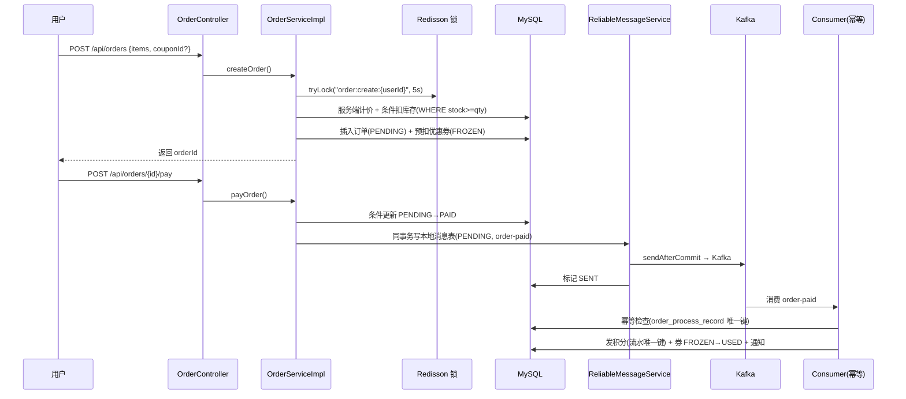
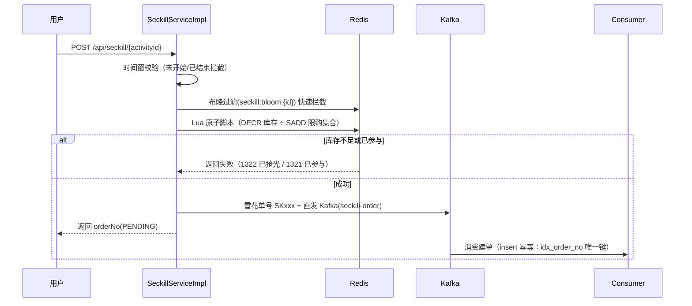
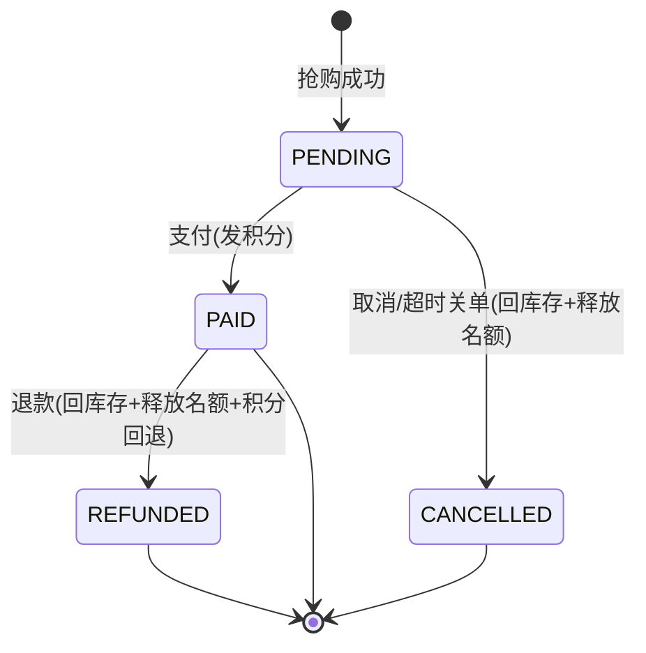

# LinkForge 后端架构详解

> 本文档基于**实际代码**编写（2026-08 版本），描述分层设计、核心机制时序、数据模型与状态机。

## 1. 分层架构

```
┌───────────────────────────────────────────────────────────────┐
│  Controller（10 个）                                          │
│  Auth / User / Product / Order / Seckill(+Admin) / Cart       │
│  / Coupon / File / Support                                    │
└──────────────────────────┬────────────────────────────────────┘
                           │ 统一响应 Result<T> / 全局异常 GlobalExceptionHandler
┌──────────────────────────▼────────────────────────────────────┐
│  过滤器链（Filter / Interceptor）                             │
│  TraceFilter（TraceId 链路）→ RateLimitInterceptor（限流）    │
│  → JwtAuthenticationFilter（JWT → SecurityContext）          │
└──────────────────────────┬────────────────────────────────────┘
┌──────────────────────────▼────────────────────────────────────┐
│  Service 层（业务 + 事务 + 分布式锁 + 消息发送）              │
│  User / Order / Product / Seckill / Cart / Coupon / Points    │
│  / Notification / ReliableMessage / Support(ChatProvider)     │
└──────────────────────────┬────────────────────────────────────┘
┌──────────────────────────▼────────────────────────────────────┐
│  数据访问：MyBatis（注解+XML） + Spring Data JPA（实体映射）  │
│  基础设施：MySQL8 / Redis(缓存+Redisson 锁) / Kafka4           │
└───────────────────────────────────────────────────────────────┘
```

- **Controller** 只做参数校验与路由，无业务逻辑
- **Service** 承担全部业务规则、事务边界（`@Transactional`）与并发控制
- **Mapper** 使用注解 SQL + 条件更新（`WHERE status='PENDING'` 等）作为并发安全的最后一层保障
- userId 一律取自 `SecurityUtil.getCurrentUserId()`（SecurityContext），**不信任前端传参**

## 2. 核心机制时序

### 2.1 下单 + 支付（可靠消息最终一致）



关键点：
- **消息与业务同事务**：先写本地消息表再发 Kafka，事务提交后才真正发送
- **补偿任务**（`ReliableMessageServiceImpl` 定时扫描）：PENDING 消息重发，幂等键防重复
- **消费幂等**：`order_process_record` 唯一键 + 条件更新，重复消息跳过

### 2.2 秒杀抢购（Lua 原子 + Kafka 削峰）



### 2.3 秒杀订单生命周期



## 3. 数据模型（核心表）

| 表 | 关键字段 | 说明 |
|----|---------|------|
| `users` | username(唯一), password(BCrypt), role, status | 角色 USER/ADMIN |
| `orders` | order_no(雪花), user_id, total_amount, coupon_id, coupon_discount, final_amount, status | 订单主表 |
| `order_items` | order_id, product_id, quantity, price | 订单明细（快照价） |
| `seckill_activities` | name, seckill_price, product_id, total_stock, available_stock, start_time, end_time, status | 秒杀活动 |
| `seckill_orders` | order_no(唯一), user_id, activity_id, product_id, price, status | 秒杀单（独立表） |
| `cart_items` | user_id, product_id(UNIQUE 联合), quantity | 购物车 |
| `coupons` / `user_coupons` | 券模板 / 用户券(FROZEN→USED) | 满减券 |
| `points_log` | user_id, type, amount, order_no, uk(order_no,type) | 积分流水（幂等锚点） |
| `order_process_record` | order_no(唯一), process_type | 消费幂等锚点 |
| `rel_message` | topic, key, payload, status(PENDING/SENT) | 可靠消息本地表 |

## 4. 并发控制策略（防超卖/防重复）

| 场景 | 手段 |
|------|------|
| 重复下单 | Redisson 锁（同用户 5s）+ 服务端计价 |
| 普通订单库存 | `UPDATE products SET stock=stock-? WHERE id=? AND stock>=?`（条件更新） |
| 秒杀抢购 | Redis Lua（DECR+SADD 原子）+ DB 条件扣减双保险 |
| 秒杀支付/取消/退款 | `UPDATE ... WHERE order_no=? AND user_id=? AND status='PENDING'` |
| 消息重复消费 | order_process_record 唯一键 + 条件更新 |
| 积分重复发放/回退 | points_log uk(order_no,type) |

## 5. 安全设计

| 层级 | 措施 |
|------|------|
| 认证 | 无状态 JWT（HS384，24h），JwtAuthenticationFilter 解析注入 SecurityContext |
| 授权 | SecurityConfig URL 规则（写操作/管理接口 ADMIN-only）+ Service 层 SecurityUtil.isAdmin() 二次校验 |
| 防提权 | 注册强制 USER；createUser 仅 ADMIN 可指定 ADMIN 角色 |
| 越权防护 | 订单/购物车/秒杀单查询与操作均校验归属（userId 从 SecurityContext 取） |
| 限流 | 登录 5次/分、注册 10次/时、全局 100 QPS（Redis 计数器，IPv6 localhost 注意 ::1） |
| 上传 | 类型白名单 + ≤5MB + UUID 文件名 + ADMIN 权限 |
| 敏感配置 | prod profile 全环境变量化（DB/Redis/Kafka/JWT/上传目录/AI Key） |

## 6. 配置与 Profile

| Profile | 用途 | 特点 |
|---------|------|------|
| `dev`（默认） | 本地开发 | ddl-auto=update、SQL 日志、DEBUG 级别 |
| `prod` | 生产/Docker | 环境变量注入、WARN 级别、ddl-auto=update（演示） |

## 7. 定时任务

| 任务 | 周期 | 作用 |
|------|------|------|
| `ReliableMessageServiceImpl` 补偿 | 10s | 重发未送达的本地消息 |
| `OrderTimeoutCancelTask` | 60s | 普通订单超时关单（15min）→ 回退库存/券/积分 |
| `SeckillTimeoutCancelTask` | 60s | 秒杀单超时关单（15min）→ 回库存/释放名额 |
